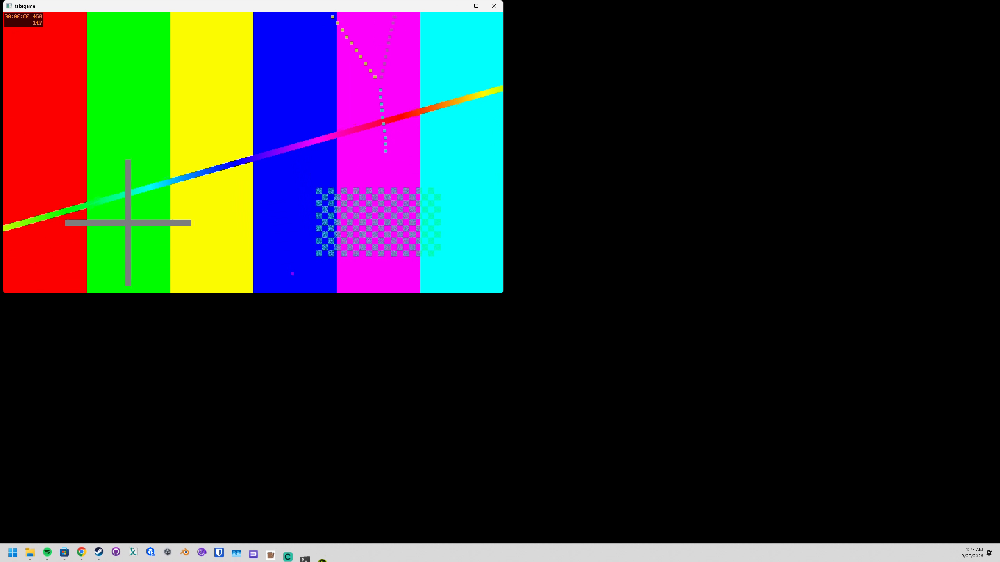

# offstage

Runs a program on a throwaway virtual monitor of any size, from 640x480 to 8K, and records it to mp4
or shows it live in an ordinary window. The monitor exists only while offstage runs. Meant for
test runs of games and recomps that need a real display, without them landing on your screen.

## Status

v0.1.0, **alpha**. Verified end to end at the console on one machine (Windows 11 Pro 26200,
RTX 5070, 4K at 200% scaling plus a 1080p monitor): the driver installs, `hold` and `hold --view` work,
and `run --record` moves the program onto the virtual monitor and records it. It does **not** work from
inside an RDP session; connect with VNC, Parsec or Moonlight instead. See [docs/rdp.md](docs/rdp.md).

## Screenshots

A frame from `offstage run --size 2560x1440 --record run.mp4 -- ffplay ... testsrc2`: the program's
window moved onto the virtual monitor, captured at the monitor's full size.



## Getting Started

Prerequisites: Windows 10/11 x64, Visual Studio 2022 (or Build Tools) with the C++ workload,
Rust 1.85+, ffmpeg 7+ with `ffplay` on PATH (`winget install Gyan.FFmpeg`), and git.

1. Clone with the driver submodule:
   ```
   git clone --recurse-submodules <repo> offstage
   cd offstage
   ```
2. Build and sign the virtual display driver. No admin needed. The first run downloads about
   1.2 GB of WDK/SDK NuGet packages into `driver\packages\`.
   ```
   driver\build-driver.cmd
   ```
   It ends with `Built and signed: ...\driver\out`.
3. From an **elevated** prompt, install it. This trusts your local signing cert; read
   [docs/driver.md](docs/driver.md) first.
   ```
   driver\install-driver.cmd
   ```
4. Build offstage:
   ```
   cargo build --release
   ```
5. Check it works:
   ```
   target\release\offstage hold --view 1920x1080
   ```
   This should print the new monitor (`\\.\DISPLAYn 1920x1080@60 at (x, y), dxgi adapter a output o`)
   and open a window showing it. Ctrl+C removes it.

## Usage

```
offstage run --size 2560x1440 --record run.mp4 -- mygame.exe --level 3
```
Adds a 2560x1440 monitor, starts the game, and keeps every window its process tree opens on that
monitor. It records until the game exits, then removes the monitor. The exit code is the game's.

```
offstage run --size 3840x2160@120 --view -- build\recomp.exe
```
Watch instead of record. The viewer is a normal window: minimize it when you don't need it.

```
offstage hold --view 1920x1080 1920x1080 2560x1440
```
Several monitors at once, each with its own viewer, until Ctrl+C.

Over RDP, virtual monitors can't reach your session. `--wait` queues the run until the session is
back on the console. With the opt-in park task, that happens when you disconnect. See
[docs/rdp.md](docs/rdp.md).

`--encoder` takes any ffmpeg encoder. The default is `h264_nvenc`; use `h264_amf`, `h264_qsv`, or
`libx264` on other hardware.

## Limits

- **Focus.** The program still runs on your desktop. Windows usually stops background launches
  from stealing focus, but it doesn't guarantee it. Full isolation needs a separate machine or VM.
- **Moves, doesn't resize.** A window is moved onto the virtual monitor within 100 ms. A
  borderless-fullscreen game that sized itself to your primary monitor in that time keeps that size.

## Building from source

Driver: `driver\build-driver.cmd`. Why it compiles with `cl`/`link` instead of MSBuild:
[docs/driver.md](docs/driver.md). CLI: `cargo build --release`. Design:
[docs/architecture.md](docs/architecture.md).

## License

MIT. The driver in `driver/SudoVDA` is [SudoVDA](https://github.com/SudoMaker/SudoVDA) (MIT), based
on Microsoft's Indirect Display sample (MIT).
